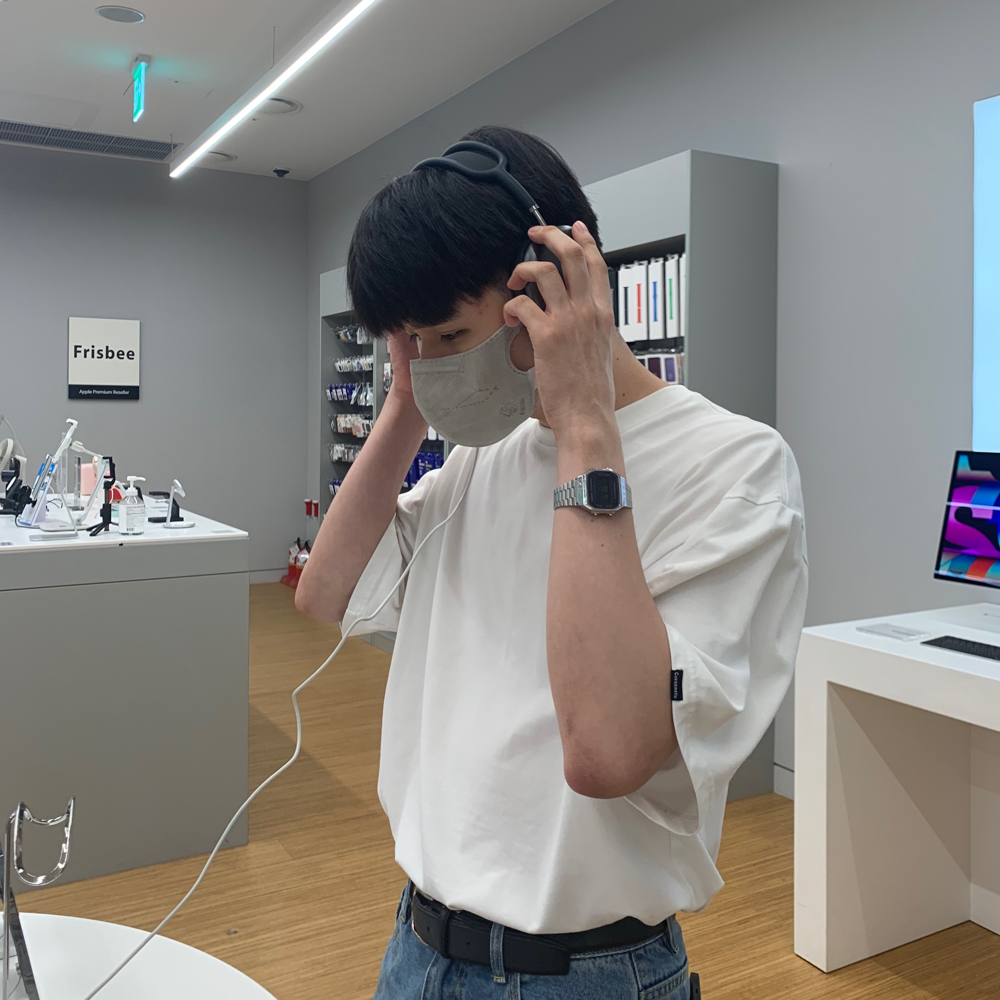
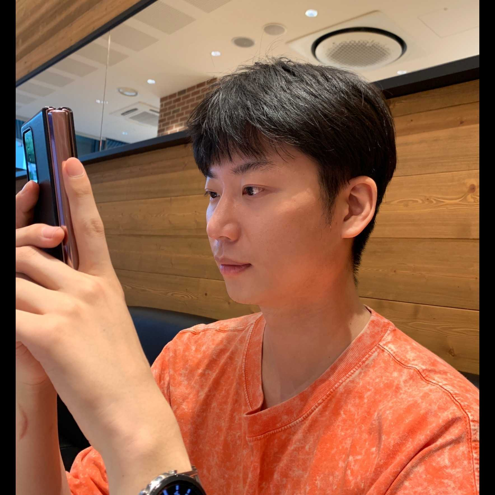

# :page_facing_up: RIDI 웹툰 Clone 프로젝트 COTAKU TOON

## :book: 프로젝트 소개

- 배포 : https://cotaku-ridi.vercel.app/

|         | 미성년자 |  성인  |
| :-----: | :------: | :----: |
| Test ID |   kids   | adult  |
| Test PW |  123456  | 123456 |

### 프로젝트 설명

- 'COTAKU TOON' 프로젝트는 (코딩 + 오타쿠 = 코타쿠) 라는 뜻으로 리디 웹툰에 알맞게 지은 팀명이자 프로젝트명입니다.
- 웹툰이라는 장르는 전 세계에서 한국이 최초로 시행한 만화 서비스 형태이고 일본, 미국, 동남아 등으로 널리 퍼지고 있습니다.
- 국내외로 급 부상중인 이런 웹툰 시장중 좋은 네임 밸류를 가진 기업의 FE 부분을 클론 코딩하며 성장하고자 해당 페이지를 선정하였습니다.

### 프로젝트 설계

- Vanilla.js를 이용하여 SPA로 제작하였고 화면을 컴포넌트 단위로 쪼개 재사용성을 높였습니다.
- 컴포넌트 구분은 재사용 여부를 기준으로 less 아토믹하게 분류하였습니다.
- 가독성과 추후 diff 알고리즘 적용 가능성을 위해 dom str을 반환하고 이벤트를 #root에 추가하는 형식으로 작성하였습니다.
- 매끄러운 화면 전환을 위해 라우터를 구현하였습니다.
- 로그인/회원가입 기능과 라우터를 구현하기 위해 express.js를 사용하였습니다.
- 보안성 향샹과 서버 공간성 절약을 위해 JWT를 이용하여 로그인 / 회원가입 서비스를 구현하였습니다.
- Vercel을 이용하여 배포하였습니다.

### 형상 관리 및 이슈 관리

- 브랜치 전략 : Github-flow
- 이슈 및 일정 관리 : Jira -> Notion
- 처음엔 Jira를 사용하였지만 프로젝트의 사이즈에 알맞게 기능은 동일하나 좀 더 라이트한 툴인 노션을 이용하였습니다.

<a href="https://peaceful-board-756.notion.site/COTAKU-Project-75d4a32f2df845e5b3ed723fee101b85">
  
</a>

## :ghost: 팀원 소개

|                                                    안지웅 (FE)                                                    |                                                이조은 (FE)                                                |                                                   정세훈 (FE)                                                    |                                                   황성재 (FE)                                                    |
| :---------------------------------------------------------------------------------------------------------------: | :-------------------------------------------------------------------------------------------------------: | :--------------------------------------------------------------------------------------------------------------: | :--------------------------------------------------------------------------------------------------------------: |
|                                            |                                    |                                            |                                            |
| email: dkswldnd10@gmail.com <br /> blog: https://woongweb.tistory.com <br /> Github: https://github.com/Anjiwoong | email: imjoeun08@naver.com <br /> blog: https://velog.io/@rlorxl <br /> Github: https://github.com/rlorxl | email: tpgns933@gmail.com <br /> blog: https://velog.io/@tpgns933 <br /> Github: https://github.com/jeong-se-hun | email: edx2fire@korea.ac.kr <br /> blog: https://velog.io/@liketiger <br /> Github: https://github.com/liketiger |

## 역할 분담

#### 안지웅

- 라우터 구현
- 회원 나이기반 성인 컨텐츠 렌더
- 개정별 마이페이지 기능
- 메인페이지, header 마크업
- 웹툰 검색 기능
- webtoon 페이지 컴포넌트화
- 메인페이지 컴포넌트화
- 메인 Carousel 기능
- mypage 최근 본 목록 기능
- scss파일 폴더 구분화
- category에 맞는 웹툰 Carousel 및 클

#### 이조은

- 메인페이지 캐러셀 기능
- 웹툰 mok data 생성
- 로그인/회원가입 페이지 마크업
- 

#### 정세훈

- 주저리
- 주저리
- 주저리
- 주저리

#### 황성재

- 마이페이지 & 뷰어페이지 마크업 및 컴포넌트화
- 라우터 구현
- 마이페이지 모달 구현
- 뷰어페이지 화면 테마 전환 및 화면 확대 기능 구현
- Vercel로 웹애플리케이션 배포
- Github-flow 세팅
- 토스터공통 컴포넌트 추출

## 🛠️ 기술 스택


 
  <br />

 


## 기능 구현 (움짤)

## 프로젝트 실행

```
npm install
npm start
```

## 폴더 구조 ( 바꿔야함 )

```assets : 이미지 파일 집합
components : 재사용 가능한 컴포넌트 집합
template : 페이지를 만들 수 있도록 컴포넌트/레이아웃 주입
pages : 유저가 보는 실제 콘텐츠
style : 공통 스타일드 컴포넌트, reset.css, 프로젝트 컬러 상수화


📦COTAKU TOON
├─📂public
└─📂src
    ├─📂assets
    ├─📂components
    │  ├─📂animalBox
    │  ├─📂button
    │  ├─📂comment
    │  ├─📂commentList
    │  ├─📂deleteAlert
    │  ├─📂errorMessage
    │  ├─📂followCompo
    │  ├─📂iconButton
    │  ├─📂imgUploadBox
    │  ├─📂input
    │  ├─📂navBack
    │  ├─📂post
    │  ├─📂postModal
    │  ├─📂profile
    │  ├─📂profileIcon
    │  ├─📂speechBubble
    │  ├─📂tabMenu
    │  └─📂user
    ├─📂pages
    ├─📂reducers
    ├─📂style
    │  └─📂fonts
    └─📂template
        ├─📂chat
        ├─📂follow
        ├─📂homePost
        ├─📂login
        ├─📂main
        ├─📂postDetail
        ├─📂postModify
        ├─📂profile
        ├─📂profileModify
        ├─📂profilePost
        ├─📂search
        ├─📂signUp
        ├─📂snsFeed
        ├─📂snsPost
        ├─📂snsPostModify
        └─📂walkingFeed

```
