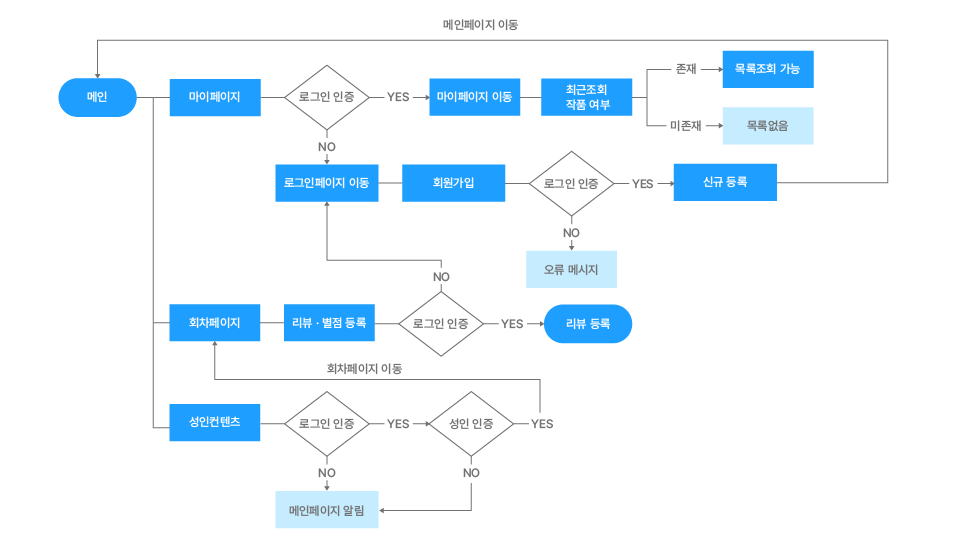

# :page_facing_up: RIDI 웹툰 Clone 프로젝트 COTAKU TOON

## :book: 프로젝트 소개

- 배포 : https://cotaku-ridi.vercel.app/

|         | 미성년자 |  성인  |
| :-----: | :------: | :----: |
| Test ID |   kids   | adult  |
| Test PW |  123456  | 123456 |

### 프로젝트 설명

- 'COTAKU TOON' 프로젝트는 (코딩 + 오타쿠 = 코타쿠) 라는 뜻으로 리디 웹툰에 알맞게 지은 팀명이자 프로젝트명입니다.
- 웹툰이라는 장르는 전 세계에서 한국이 최초로 시행한 만화 서비스 형태이고 일본, 미국, 동남아 등으로 널리 퍼지고 있습니다.
- 국내외로 급 부상중인 이런 웹툰 시장중 좋은 네임 밸류를 가진 기업의 FE 부분을 클론 코딩하며 성장하고자 해당 페이지를 선정하였습니다.

### 프로젝트 설계

- Vanilla.js를 이용하여 SPA로 제작하였고 화면을 컴포넌트 단위로 쪼개 재사용성을 높였습니다.
- 컴포넌트 구분은 재사용 여부를 기준으로 less 아토믹하게 분류하였습니다.
- 가독성과 추후 diff 알고리즘 적용 가능성을 위해 dom str을 반환하고 이벤트를 #root에 추가하는 형식으로 작성하였습니다.
- 매끄러운 화면 전환을 위해 라우터를 구현하였습니다.
- 로그인/회원가입 기능과 라우터를 구현하기 위해 express.js를 사용하였습니다.
- 보안성 향샹과 서버 공간성 절약을 위해 JWT를 이용하여 로그인 / 회원가입 서비스를 구현하였습니다.
- Vercel을 이용하여 배포하였습니다.

### 형상 관리 및 이슈 관리

- 브랜치 전략 : Github-flow
- 이슈 및 일정 관리 : Jira -> Notion
- 처음엔 Jira를 사용하였지만 프로젝트의 사이즈에 알맞게 기능은 동일하나 좀 더 라이트한 툴인 노션을 이용하였습니다.

<a href="https://peaceful-board-756.notion.site/COTAKU-Project-75d4a32f2df845e5b3ed723fee101b85">
  
</a>

## <center>:ghost: 팀원 소개 </center>

|                                                    안지웅 (FE)                                                    |                                                이조은 (FE)                                                |                                                   정세훈 (FE)                                                    |                                                   황성재 (FE)                                                    |
| :---------------------------------------------------------------------------------------------------------------: | :-------------------------------------------------------------------------------------------------------: | :--------------------------------------------------------------------------------------------------------------: | :--------------------------------------------------------------------------------------------------------------: |
|                                            |                                    |                                            |                                            |
| email: dkswldnd10@gmail.com <br /> blog: https://woongweb.tistory.com <br /> Github: https://github.com/Anjiwoong | email: imjoeun08@naver.com <br /> blog: https://velog.io/@rlorxl <br /> Github: https://github.com/rlorxl | email: tpgns933@gmail.com <br /> blog: https://velog.io/@tpgns933 <br /> Github: https://github.com/jeong-se-hun | email: edx2fire@korea.ac.kr <br /> blog: https://velog.io/@liketiger <br /> Github: https://github.com/liketiger |

## <center>🙋‍♀️ 역할 분담</center>

#### 안지웅

- 라우터 구현
- 회원 나이기반 성인 컨텐츠 렌더
- 개정별 마이페이지 기능
- 메인페이지, header 마크업
- 웹툰 검색 기능
- webtoon 페이지, 메인페이지 컴포넌트화
- 메인 Carousel 기능
- mypage 최근 본 목록 기능
- category에 맞는 웹툰 Carousel 렌더 및 클릭한 웹툰 상세 페이지
- scss파일 폴더 구분화

---

#### 이조은

- 메인페이지 캐러셀 기능
- 로그인/회원가입 기능
- 웹툰 mok data 생성
- 로그인/회원가입 페이지 마크업
- 뷰어 페이지 마크업

---

#### 정세훈

- 웹툰 페이지 마크업 및 스타일 적용
- 웹툰 mok data 생성
- JWT 토큰 & express를 이용한 로그인 기능
- 화면 전환 및 새로고침 시 JWT 토큰 인증을 통한 로그인 유지 기능
- 공용 헤더 푸터 마크업 및 스타일 적용
- 웹툰 페이지 별점 기능
- 웹툰 페이지 모달 기능
- 웹툰 페이지 대여 & 소장 탭 이벤트 및 더 보기 이벤트
- 웹툰 페이지 댓글 기능
- 메인 페이지 캐러셀 기능 (메인 캐러셀 제외 모든 캐러셀)

---

#### 황성재

- 마이페이지 & 뷰어페이지 마크업 및 컴포넌트화
- 라우터 구현
- 마이페이지 모달 구현
- 뷰어페이지 화면 테마 전환 및 화면 확대 기능 구현
- Vercel로 웹애플리케이션 배포
- Github-flow 세팅
- Toaster 기능을 공통 컴포넌트로 추출

---

## 🛠️ 기술 스택

 <br />


## 기능 구현

|                               로그인                               |                              회원가입                               |
| :----------------------------------------------------------------: | :-----------------------------------------------------------------: |
|  |  |

|                               Carousel                               |                            검색 기능                            |
| :------------------------------------------------------------------: | :-------------------------------------------------------------: |
|  |  |

|                               회차페이지                               |                              뷰어                               |
| :--------------------------------------------------------------------: | :-------------------------------------------------------------: |
|  |  |

|                               최근조회                               |                 성인 인증에 따른 Thumbnail 변경                 |
| :------------------------------------------------------------------: | :-------------------------------------------------------------: |
|  |  |

## 🕹 프로젝트 실행

```
npm install
npm start
```

## 🌊 프로세스 플로우



## 🗂 폴더 구조

```
fake-data: 서버가 없으므로 회원 데이터를 목 데이터로 관리
public: 배포용 폴더
assets: 이미지 파일 폴더
css: 빌드 한 style.css 와 디버깅을 위한 style.css.map
data: webtoon mok data
js: 컴포넌트 및 페이지 js 모음


📦COTAKU TOON
└─📂RIDIProject
  ├─📂 fake-data
  ├─📂 public
  │ ├─📂assets
  │ ├─📂css
  │ ├─📂data
  │ │ └─📄 db.json
  │ ├─📂js
  │ │  ├─📂components
  │ │  └─📂pages
  │ └─📄 index.html
  ├─📂 scss
  ├─🛠 .env
  └─🖥 server.js


```
